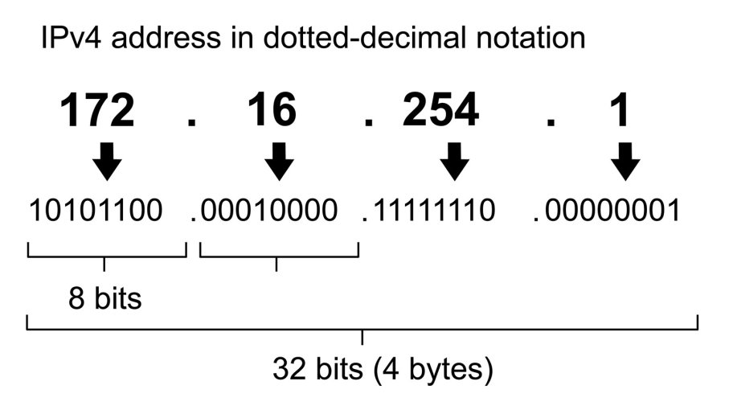

# Web infrastructure design
### stack

# Network basics
### System engineering & DevOps

Networking is a big part of what made computers so powerful and why the Internet exists. It allows machines to communicate with each other.

+ **What is a protocol**

Network protocols are sets of established rules that dictate how to format, transmit and receive data so computer network devices -- from servers and routers to endpoints -- can communicate regardless of the differences in their underlying infrastructures, designs or standards.  
A set of cooperating network protocols is called a protocol suite. The TCP/IP suite includes numerous protocols across layers -- such as the data, network, transport and application layers -- working together to enable internet connectivity. These include:

+  + Transmission Control Protocol (TCP), which uses a set of rules to exchange messages with other internet points at the information packet level;
+  + User Datagram Protocol (UDP), which acts as an alternative communication protocol to TCP and is used to establish low-latency and loss-tolerating connections between applications and the Internet.
+  + Internet Protocol (IP), which uses a set of rules to send and receive messages at the Internet address level
+  + additional network protocols that include the Hypertext Transfer Protocol (HTTP) and File Transfer Protocol (FTP), each of which has defined sets of rules to exchange and display information.
  
Major types of network protocols  
Generally speaking, networks have three types of protocols -- communication, such as Ethernet; management, such as the Simple Mail Transfer Protocol (SMTP); and security, such as Secure Shell (SSH).

+ **What is an IP address**

Every machine on a network has a unique identifier. Just as you would address a letter to send in the mail, computers use the unique identifier to send data to specific computers on a network. Most networks today, including all computers on the internet, use the TCP/IP protocol as the standard for how to communicate on the network. In the TCP/IP protocol, the unique identifier for a computer is called its IP address.

An IP address can be either dynamic or static. A static address is a permanently assigned address. Static IP addresses assigned by internet service providers are rare. You can assign static IPs to devices on your local network. Dynamic addresses are the most common. They're assigned by the Dynamic Host Configuration Protocol (DHCP), a service running on the network. DHCP typically runs on network hardware such as routers or dedicated DHCP servers.

Dynamic IP addresses are issued using a leasing system, meaning that the IP address is only active for a limited time. If the lease expires, the computer will automatically request a new lease.

Cuatro reservas específicas incluyen lo siguiente:

+ + 0.0.0.0 : Esto representa la red predeterminada, que es el concepto abstracto de estar conectado a una red TCP / IP.
+ + 255.255.255.255: esta dirección está reservada para transmisiones de red o mensajes que deben ir a todas las computadoras de la red.
+ + 127.0.0.1 : Esto se denomina dirección de bucle invertido, lo que significa la forma en que su computadora se identifica, tenga o no una dirección IP asignada.
+ + 169.254.0.1 a 169.254.255.254 : este es el rango de direcciones de direcciones IP privadas automáticas (APIPA) asignadas automáticamente cuando una computadora no consigue obtener una dirección de un servidor DHCP.

If you use a router to share an internet connection, the router gets the IP address issued directly from the ISP. Then, it creates and manages a subnet for all the computers connected to that router. If your computer's address falls into one of the reserved subnet ranges listed earlier, you're going through a router rather than connecting directly to the internet.

IP addresses on a subnet have two parts: network and node. The network part identifies the subnet itself. The node, also called the host, is an individual piece of computer equipment connected to the network and requiring a unique address. Each computer knows how to separate the two parts of the IP address by using a subnet mask. A subnet mask looks somewhat like an IP address, but it's actually just a filter used to determine which part of an IP address designates the network and node.

+ **What is TCP/IPl**

TCP/IP, or the Transmission Control Protocol/Internet Protocol, is a suite of communication protocols used to interconnect network devices on the internet. TCP/IP can also be used as a communications protocol in a private computer network (an intranet or an extranet).

+ What is an Internet Protocol (IP) port?

