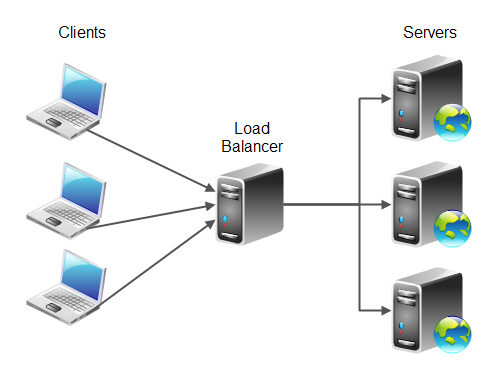

# Web infrastructure design - Notes
### stack

  

# Network basics
### System engineering & DevOps

Networking is a big part of what made computers so powerful and why the Internet exists. It allows machines to communicate with each other.

---
 
# What is a protocol

Network protocols are sets of established rules that dictate how to format, transmit and receive data so computer network devices -- from servers and routers to endpoints -- can communicate regardless of the differences in their underlying infrastructures, designs or standards.  
A set of cooperating network protocols is called a protocol suite. The TCP/IP suite includes numerous protocols across layers -- such as the data, network, transport and application layers -- working together to enable internet connectivity. These include:

+  + Transmission Control Protocol (TCP), which uses a set of rules to exchange messages with other internet points at the information packet level;
+  + User Datagram Protocol (UDP), which acts as an alternative communication protocol to TCP and is used to establish low-latency and loss-tolerating connections between applications and the Internet.
+  + Internet Protocol (IP), which uses a set of rules to send and receive messages at the Internet address level
+  + additional network protocols that include the Hypertext Transfer Protocol (HTTP) and File Transfer Protocol (FTP), each of which has defined sets of rules to exchange and display information.
  
Major types of network protocols  
Generally speaking, networks have three types of protocols -- communication, such as Ethernet; management, such as the Simple Mail Transfer Protocol (SMTP); and security, such as Secure Shell (SSH).

# What is an IP address

Every machine on a network has a unique identifier. Just as you would address a letter to send in the mail, computers use the unique identifier to send data to specific computers on a network. Most networks today, including all computers on the internet, use the TCP/IP protocol as the standard for how to communicate on the network. In the TCP/IP protocol, the unique identifier for a computer is called its IP address.

An IP address can be either dynamic or static. A static address is a permanently assigned address. Static IP addresses assigned by internet service providers are rare. You can assign static IPs to devices on your local network. Dynamic addresses are the most common. They're assigned by the Dynamic Host Configuration Protocol (DHCP), a service running on the network. DHCP typically runs on network hardware such as routers or dedicated DHCP servers.

Dynamic IP addresses are issued using a leasing system, meaning that the IP address is only active for a limited time. If the lease expires, the computer will automatically request a new lease.

Four specific reservations include the following:

+ + 0.0.0.0 : This represents the default network, which is the abstract concept of being connected to a TCP/IP network.
+ + 255.255.255.255: this address is reserved for network transmissions or messages that must go to all computers on the network.
+ + 127.0.0.1 : This is called the inverted loop address, which means the way your computer identifies itself, whether or not it has an IP address assigned to it.
+ + 169.254.0.1 to 169.254.255.254 : This is the range of automatic private IP address (APIPA) addresses automatically assigned when a computer fails to obtain an address from a DHCP server.

If you use a router to share an internet connection, the router gets the IP address issued directly from the ISP. Then, it creates and manages a subnet for all the computers connected to that router. If your computer's address falls into one of the reserved subnet ranges listed earlier, you're going through a router rather than connecting directly to the internet.

IP addresses on a subnet have two parts: network and node. The network part identifies the subnet itself. The node, also called the host, is an individual piece of computer equipment connected to the network and requiring a unique address. Each computer knows how to separate the two parts of the IP address by using a subnet mask. A subnet mask looks somewhat like an IP address, but it's actually just a filter used to determine which part of an IP address designates the network and node.

# What is TCP/IPl

TCP/IP, or the Transmission Control Protocol/Internet Protocol, is a suite of communication protocols used to interconnect network devices on the internet. TCP/IP can also be used as a communications protocol in a private computer network (an intranet or an extranet).

TCP defines how applications can create channels of communication across a network. It also manages how a message is assembled into smaller packets before they are then transmitted over the internet and reassembled in the right order at the destination address.

IP defines how to address and route each packet to make sure it reaches the right destination. Each gateway computer on the network checks this IP address to determine where to forward the message.

- HTTP (Protocolo de transferencia de hipertexto) maneja la comunicación entre un servidor web y un navegador web.
- HTTPS (HTTP seguro) maneja la comunicación segura entre un servidor web y un navegador web.
- FTP (Protocolo de transferencia de archivos) maneja la transmisión de archivos entre computadoras.

### client-server model
is a relationship in which one program (the client) requests a service or resource from another program (the server). 

The differences between the TCP/IP model and the OSI model include the following:

- TCP/IP uses just one layer (application) to define the functionalities of the upper layers, while the OSI model uses three layers (application, presentation and session).
- The TCP/IP model uses one layer (link) to define the functionalities of the bottom layers, while the OSI uses two layers (physical and data link).
- The TCP/IP model use the internet layer to define the routing standards and protocols, while OSI uses the network layer.
- The TCP/IP header size is 20 bytes while the OSI header is 5 bytes.
- The TCP/IP model is a protocol-oriented standard, whereas the OSI model is a generic model based on the functionalities of each layer.
- TCP/IP follows a horizontal approach, while OSI follows a vertical approach.
- In the TCP/IP suite, the protocols were developed first, and then the model was developed. In OSI, the model was developed first, and then the protocols in each layer were developed.
- TCP/IP helps establish a connection between different types of computers, whereas the OSI model helps standardize routers, switches, motherboards and other hardware.

# What is an Internet Protocol (IP) port

Port numbers allow different applications on the same computer to share network resources simultaneously.

Port numbers relate to network addressing. In TCP/IP networking, both TCP and UDP use a set of ports that work together with IP addresses.

These port numbers work like telephone extensions. Just as a business telephone switchboard can use the main phone number and assign each employee an extension number, a computer can have a main address and a set of port numbers to handle incoming and outgoing connections.

# Server
Servers are located in datacenters which are buildings that host hundreds, or even thousands of computers (servers). You can think of a server as a computer without a keyboard, mouse, or screen, that is accessible only by a network. A server can be physical or virtual. A server runs an OS (operating system).

A single server can serve multiple clients, and a single client can use multiple servers.

the request–response model: a client sends a request to the server, which performs some action and sends a response back to the client, typically with a result or acknowledgment. Designating a computer as "server-class hardware" implies that it is specialized for running servers on it. This often implies that it is more powerful and reliable than standard personal computers, but alternatively, large computing clusters may be composed of many relatively simple, replaceable server components.

Typical servers are database servers:
- file servers
- mail servers
- print servers
- web servers
- game servers
- and application servers

## what is the difference into server and webserver

# Web Server
## virtual machine 
is an emulation of a computer system. Virtual machines are based on computer architectures and provide functionality of a physical computer. Their implementations may involve specialized hardware, software, or a combination.

There are different kinds of virtual machines, each with different functions:

- System virtual machines (also termed full virtualization VMs) provide a substitute for a real machine. They provide functionality needed to execute entire operating systems. A hypervisor uses native execution to share and manage hardware, allowing for multiple environments which are isolated from one another, yet exist on the same physical machine. Modern hypervisors use hardware-assisted virtualization, virtualization-specific hardware, primarily from the host CPUs.
- Process virtual machines are designed to execute computer programs in a platform-independent environment.
### What’s The Difference: Host vs. Guest OS?
host operating systems run on hardware and guest operating systems run on a virtual machine.

## containers
A container consists of an entire runtime environment: an application, plus all its dependencies, libraries and other binaries, and configuration files needed to run it, bundled into one package. By containerizing the application platform and its dependencies, differences in OS distributions and underlying infrastructure are abstracted away.

  <a href="https://www.youtube.com/watch?v=FWpnbGnzk08">
    
  <a>

"Web server" can refer to hardware or software

# DNS
A root domain is the parent domain to a sub domain, and its name is not, and can not be divided by a dot.
DNS is an distributed system. To find an IP address of a given domain, you have to query one of the root servers first. However, not everyone needs to query root servers since most people use ISP hosted DNS server which does the resolving task on their behalf and caches the result.

NS or name server records are used for recursively resolving the required domain name. NS records are used to tell the DNS resolver which DNS server is responsible for the given zone which is basically used to redirect the resolver to the DNS server hosting the next level domain.

###  A record
An A record maps a domain name to the IP address (Version 4) of the computer hosting the domain. An A record is used to find the IP address of a computer connected to the internet from a name.

### CNAME redord
A Canonical Name record (abbreviated as CNAME record) is a type of resource record in the Domain Name System (DNS) which maps one domain name (an alias) to another

CNAME records must always point to another domain name, never directly to an IP address

### MX record
A TXT record (short for text record) is a type of resource record in the Domain name systemically[1] (DNS) used to provide the ability to associate arbitrary text with a host or other name, such as human readable information about a server, network, data center, or other accounting information.

### TXT
Un registro TXT (abreviatura de registro de texto ) es un tipo de registro de recursos en el Nombre de dominio sistémicamente [1] (DNS) utilizado para proporcionar la capacidad de asociar texto arbitrario con un host u otro nombre, como información legible por humanos sobre un servidor , red, centro de datos u otra información contable.

## What Is Round Robin DNS?
Round robin DNS is nothing but a simple technique of load balancing various Internet services such as Web server, e-mail server by creating multiple DNS A records with the same name.

###  NS Record
An NS record delegates a subdomain to a set of name servers. Whenever you delegate a domain to DNSimple, the TLD authorities place NS records for your domain in the TLD name servers pointing to us.  
NS or name server records are used for recursively resolving the required domain name. NS records are used to tell the DNS resolver which DNS server is responsible for the given zone which is basically used to redirect the resolver to the DNS server hosting the next level domain.

### SOA record
An SOA record is a Start of Authority. Every domain must have a Start of Authority record at the cutover point where the domain is delegated from its parent domain. 

One of the reasons why you need www or some other subdomain has to do with a quirk of DNS and the CNAME record.

Suppose for the purposes of this example that you are running a big site and contract out hosting to a CDN (Content Distribution Network) such as Akamai. What you typically do is set up the DNS record for your site as a CNAME to some akamai.com address. This gives the CDN the opportunity to supply an IP address that is close to the browser (in geographic or network terms). If you used an A record on your site, then you would not be able to offer this flexibility.

### En resumen, los registros NS se usan para redirigir el solucionador DNS al siguiente servidor DNS que aloja la zona del siguiente nivel. Y, el clúster de servidores DNS utiliza el registro SOA para sincronizar los últimos cambios del servidor maestro al servidor secundario.

###  root domain and sub domain - differences
The dot in the domain name delimits the sub domain name (the part of the name before the dot, eg. www.my.) and the root domain name ( the part after the dot, ie .domain.com). This means that the address my.domain.com is a sub domain of the root domain, whose name is domain.com

In an administrator panel at domain provider account, you can create any number of sub domains. This means that for the root domain called domain.com it is possible to create different sub domains eg. my.domain.com, your.domain.com, holberton.domain.com… Creating multiple sub domains is always free and does not require you to set up new accounts on a domain provider website.

# Load balancer
Load balancer will distribute the work-load of your system to multiple individual systems, or group of systems to to reduce the amount of load on an individual system, which in turn increases the reliability, efficiency and availability of your enterprise application or website.

### how to know server is about to overload?

# Monitoring
In the age of the data-ism, monitoring how our software systems are doing is an important thing.

Web stack monitoring can be broken down into 2 categories:

- Application monitoring: getting data about your running software and making sure it is behaving as expected
- Server monitoring: getting data about your virtual or physical server and making sure they are not overloaded (could be CPU, memory, disk or network overload)

# database
A database is a collection of information that is organized so that it can be easily accessed, managed and updated. Computer databases typically contain aggregations of data records or files, containing information about sales transactions or interactions with specific customers.

In engineering, redundancy is the duplication of critical components or functions of a system with the intention of increasing reliability of the system, usually in the form of a backup or fail-safe, or to improve actual system performance, such as in the case of GNSS receivers, or multi-threaded computer processing.

## Single point of failure (SPOF) 
 is a part of a system that, if it fails, will stop the entire system from working.
 
 In engineering, redundancy is the duplication of critical components or functions of a system with the intention of increasing reliability of the system, usually in the form of a backup or fail-safe, or to improve actual system performance, such as in the case of GNSS receivers, or multi-threaded computer processing.

### Active-Active vs. Active-Passive High-Availability Clustering
The principles of high availability (HA) are fairly standard, whether you are discussing enterprise storage, databases or any other form of HA. The basic premise is that, to maintain service in the event of unexpected component failures, you need to have at least two of everything. In the case of storage array HA, we are usually talking about the storage controllers which are the interfaces between the outside world and the persistent media on which data resides.

- In a basic active/passive design, one controller (A) handles all traffic while the other (B) simply sits there waiting for its moment of glory. That moment comes when A suffers some kind of failure – and B then leaps into action, immediately replacing A by providing the same service. There might be a minor delay as the system performs a failover, but with multipathing software in place it will usually be quick enough to go unnoticed.
- In an active/active architecture, both controllers (A and B) are available to handle traffic. This means that under normal operation you now have 2P of performance – and all for the same price of ten groats. Both the overall performance and the price/performance have doubled.

# HTTP - HTTPS

Hyper Text Transfer Protocol Secure (HTTPS) is the secure version of HTTP, the protocol over which data is sent between your browser and the website that you are connected to. The 'S' at the end of HTTPS stands for 'Secure'. It means all communications between your browser and the website are encrypted. 

HTTPS pages typically use one of two secure protocols to encrypt communications - SSL (Secure Sockets Layer) or TLS (Transport Layer Security). Both the TLS and SSL protocols use what is known as an 'asymmetric' Public Key Infrastructure (PKI) system. An asymmetric system uses two 'keys' to encrypt communications, a 'public' key and a 'private' key. Anything encrypted with the public key can only be decrypted by the private key and vice-versa.

  

# RESOURCE:
- https://searchnetworking.techtarget.com/definition/protocol
- https://computer.howstuffworks.com/internet/basics/what-is-an-ip-address.htm
- https://searchnetworking.techtarget.com/definition/TCP-IP
- https://www.lifewire.com/port-numbers-on-computer-networks-817939
- https://en.wikipedia.org/wiki/Server_(computing)#Hardware_requirement
- https://en.wikipedia.org/wiki/Virtual_machine
- https://www.cio.com/article/2924995/what-are-containers-and-why-do-you-need-them.html
- https://en.wikipedia.org/wiki/Web_server
- https://whatis.techtarget.com/definition/Web-server
- https://developer.mozilla.org/en-US/docs/Learn/Common_questions/What_is_a_web_server
- https://stackoverflow.com/questions/936197/what-is-the-difference-between-application-server-and-web-server#:~:text=While%20a%20web%20server%20handles,user%20and%20the%20displayed%20content.
- https://www.quora.com/What-is-the-difference-between-SOA-record-and-NS-record-Does-NS-record-help-the-resolver-to-identify-the-ipaddress-of-domain-without-requesting-the-root-server
